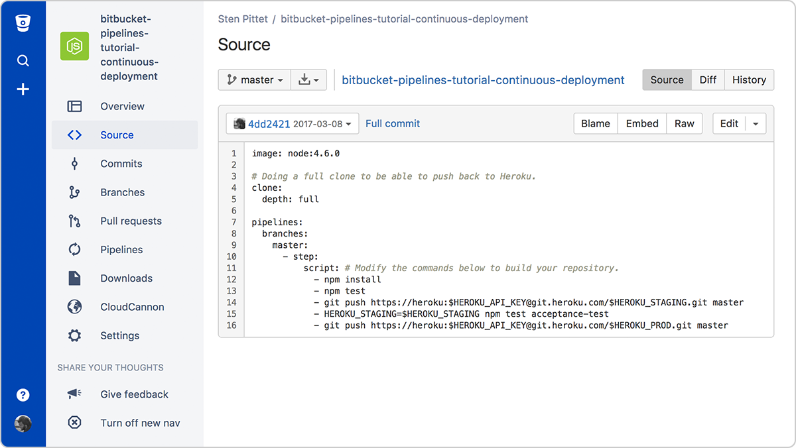

    
In the context of modern development and DevOps methods, the abbreviations CI and CD are often used. The abbreviation CI stands for continuous integration. This is a fundamental DevOps recommendation, according to which developers should regularly merge code changes into a central repository where automated builds and tests are performed. The abbreviation CD can mean both continuous delivery and continuous deployment.

# What is the difference between continuous integration, continuous delivery and continuous deployment (CI/CD)?

## Continuous integration

Developers using continuous integration merge their changes with the main branch whenever possible. The changes made by the developer are verified by creating an assembly and running automated tests on that assembly. With this approach, you avoid integration difficulties when you have to wait for the release day to merge changes in the corresponding branch.

When using continuous integration, great attention is paid to test automation, as a result of which, when integrating new commits into the main branch, the operation of the application is not disrupted.

## Continuous delivery

Continuous delivery is a continuation of continuous integration, since it automatically deploys all code changes to the test and/or production environment after the build stage.

This means that not only the testing process is automated, but also the product release process, so the application can be deployed at any time with a single click.

Theoretically, with continuous delivery, you can release releases daily, weekly, every two weeks, or at any other frequency relevant to the business. However, if you really want to benefit from continuous delivery, you should deploy to production as early as possible, ensuring that small change packages are released that are easy to find a bug in case of problems.

## Continuous deployment

Continuous deployment goes one step further than continuous delivery. With this approach, every change that goes through all stages of the production pipeline is released to customers. Human intervention is not required, and the deployment of a new change to the production environment can only be prevented by an error during the test.

Continuous deployment is a great way to speed up the customer feedback cycle and relieve the team of unnecessary stress by canceling the "release day". Developers can focus on creating software. They see how their code is put to work in a matter of minutes, once it's finished.

# How do these approaches relate to each other

Simply put, continuous integration is part of both continuous delivery and continuous deployment. And continuous deployment is similar to continuous delivery, except that releases are done automatically.

# What are the advantages of each approach?

We have explained the difference between continuous integration, continuous delivery and continuous deployment, but have not yet considered the reasons why it is worth implementing these approaches. Obviously, the implementation of each of them requires costs, but this is largely justified by the benefits received.

## Continuous integration

### What will be required of you (expenses)

- Your team will have to write automated tests for each new feature, improvement, or bug fix.
- A continuous integration server is needed that can monitor the main repository and automatically run tests for each new commit sent.
- Developers need to merge their changes as often as possible, at least once a day.

### What will you get

- Fewer bugs get into the work environment, because due to automatic tests, the deterioration is detected at an early stage.
- When all integration problems are solved at an early stage, the release build is easy.
- It is necessary to switch to another context less often, since developers receive a warning as soon as they break the build, and can work on a fix before moving on to another task.
- Testing costs are drastically reduced: Your CI server can run hundreds of tests in a few seconds.
- The quality control team spends less time on testing and can focus on improving the quality culture.

## Continuous delivery

### What will be required of you (expenses)

- Continuous integration requires a solid foundation. Your test suite should cover a sufficient portion of the code base.
- Deployments need to be automated. Although the launch is still done manually, no human intervention should be required after the deployment begins.
- Most likely, your team will need to master the flags of opportunities so that opportunities that have not been completed do not affect the work of customers.

### What will you get

- From now on, software deployment is no longer difficult. Your team no longer needs to spend several days preparing for the release.
- You can release releases more often, speeding up the feedback cycle with your customers.
- Decisions about small changes are made without unnecessary stress, which helps to speed up iterations.

## Continuous deployment

### What will be required of you (expenses)

- Your testing culture should be at the highest level. The quality of your test suite will determine the quality of your releases.
- The documentation process must keep pace with the pace of deployments.
- Feature flags are becoming an integral part of the process of releasing major changes. They provide an opportunity to coordinate work with other departments (such as support, marketing, PR, etc.).

### What will you get

- You will be able to speed up the development process, as you will not need to interrupt it during releases. Deployment pipelines are triggered automatically every time changes are made.
- The number of risks associated with releases is reduced and it is easier to release fixes in case of problems, since each deployment is carried out after making a relatively small number of changes.
- Customers see a continuous stream of improvements, while the quality is improved every day, not once a month, quarter or year.

Traditionally, one of the expenses associated with continuous integration is the installation and maintenance of the CI server. However, you can significantly reduce the cost of implementing these approaches by using a cloud service, such as Bitbucket Pipelines, which adds automation capabilities to each Bitbucket repository. By simply adding a configuration file to the root of the repository, you can create a continuous deployment pipeline that will be executed for each new change that is sent to the main branch.

# Transition from continuous integration to continuous deployment

If you are just starting work on a new project and you don't have any users yet, it may be easy for you to deploy each commit to a production environment. You can even start by automating deployments and release the alpha version to a production environment without clients. Then, as the application develops, you will enhance the testing culture and increase the code coverage. And by the time you are ready to connect users, you will have developed a great continuous deployment process where all new changes are tested before they are automatically released into the production environment.

But if you already have an application that customers use, it's worth slowing down and starting with continuous integration and continuous delivery. Start by implementing basic unit tests that run automatically. At this stage, it is too early to focus on complex end-to-end testing. Instead, you should try to automate deployments as soon as possible and move on to the stage where deployments to staging environments will be performed automatically. When you have set up automatic deployments, you can focus on improving the tests, instead of periodically making stops to coordinate the release process.

Once the software is released on a daily basis, continuous deployment can be considered. However, before doing this, you need to make sure that the rest of your organization is ready for such a turn: documentation, support, marketing. These departments also need to adapt to the new release frequency. It is important to organize the process so that they do not miss significant changes that may affect customers.
