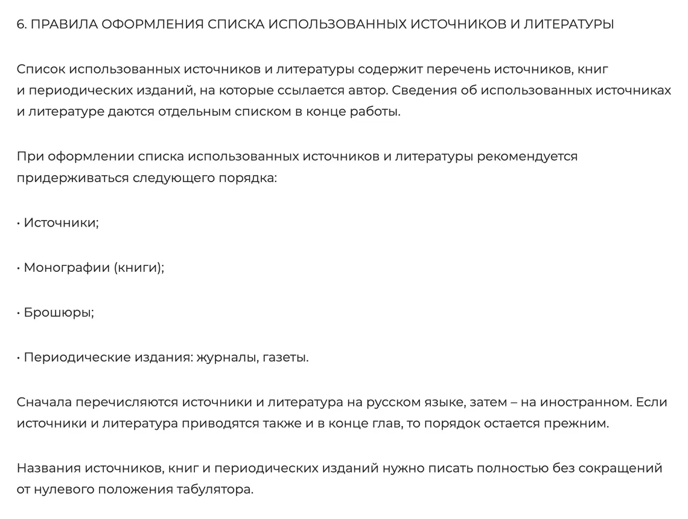
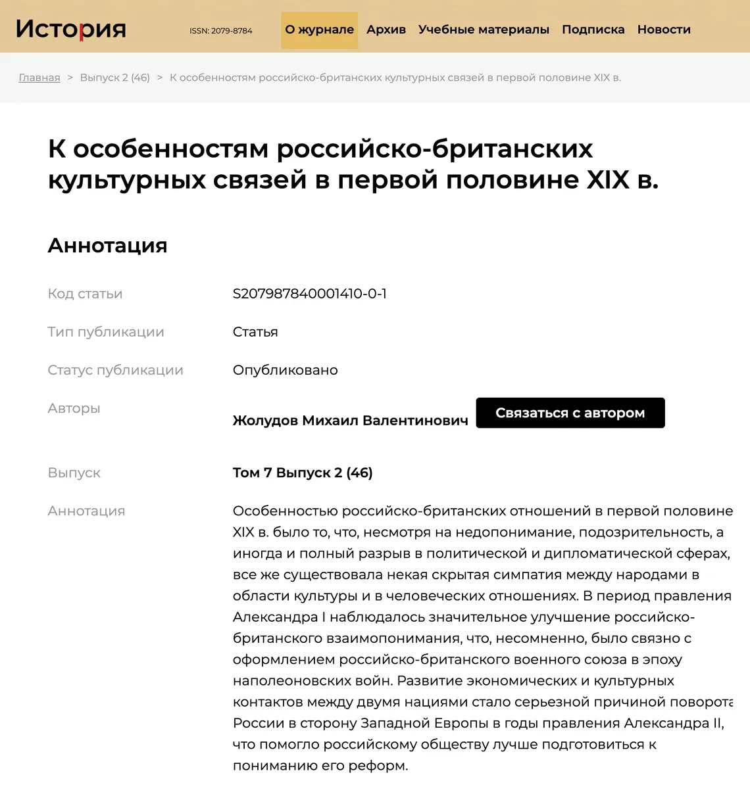

    
В курсовых и дипломных работах нужно указывать источники, к которым вы обращались при написании. Это называется библиографическим списком. Правила оформления библиографии регулирует гост, но вузы могут устанавливать свои.

## Могут ли вузы предъявлять требования к оформлению источников

Государственный стандарт устанавливает общие требования к структуре курсовых и дипломных работ. Но каждый вуз вправе принимать свои методические рекомендации по оформлению студенческих работ, в том числе библиографических списков.

При подготовке работы для вуза, например курсовой или диплома, надо пользоваться внутренними методичками учебной организации. А если правил нет — руководствоваться гостом.



## Что входит в список литературы?

Список литературы — это ресурсы, к которым вы обращались при работе над темой курсовой или диплома:

1. Книги — с одним или несколькими авторами, однотомные или многотомные.
1. Журналы — общенаучные или узкоспециальные, например для бухгалтеров, юристов, медицинские.
1. Учебники.
1. Электронные ресурсы — научные статьи в интернете, сайты со статистикой или результатами исследований, электронные журналы, сайты госорганов.
1. Законы и нормативные акты. Например, если вы пишете работу про российские школы, скорее всего, будете обращаться к Конституции и закону об образовании.

В списке литературы дают библиографическое описание каждого использованного в работе источника.

## Структура библиографического описания

Библиографическое описание — это сведения об источнике, по которым можно понять, откуда информация и как ее найти. Эти данные приводят по правилам:

1. Для печатных изданий — учебников, журналов, газет и книг — применяют ГОСТ Р 7.0.100-2018.
1. Для электронных ресурсов — ГОСТ Р 7.0.108-2022.

Каждое описание состоит из нескольких элементов — их называют областями описания. Важно указывать их по порядку:

1. Основное заглавие — название книги.
1. Сведения об ответственности — данные о тех, кто участвовал в создании ресурса.
1. Сведения об издании, например порядковый номер тиража. Еще бывают такие примеры: «Факс. изд.», «Новая версия», «Перепеч. с изд. 1925 г.», «Доп. вариант».
1. Сведения о нумерации обязательны для журналов и других периодических изданий.
1. Место публикации — город или страна.
1. Наименование издателя, причем сами слова «издатель», «издательство», «издательский дом» не указывают.
1. Дата публикации.
1. Сведения об объеме — число страниц.
1. Адрес в интернете и дата обращения к источнику — для электронных ресурсов.

В печатных изданиях данные для списка литературы публикуют на титульном листе или внутри обложки. Если их не хватает или вы знаете только название книги, можно взять нужные сведения из каталогов библиотек. Например, Российской государственной библиотеки или Российской национальной библиотеки.

В электронных ресурсах источник библиографического описания находится на самом сайте. Вот пример статьи в электронном журнале «История».

```Жолудов, М. В. К особенностям российско-британских культурных связей в первой половине XIX в. // История : электрон. науч.-образоват. журн. 2016. Т. 7. N 2 (46). URL: https://history.jes.su/ s207987840001410-0-1. Дата публикации: 14.05.2016. Режим доступа: для зарегистрир. пользователей (дата обращения: 13.10.2023).```

Области описания разделяют между собой специальными знаками. Правила их применения не имеют ничего общего с нормами языка. Например, после каждой области ставят «.-».

В таблице ниже — самые распространенные примеры применения знаков, в более сложных случаях лучше сверяться с гостом.



### Как расставлять знаки в библиографических описаниях

| Предписанный знак | Применение | Пример |
|----------|----------|----------|
| .-    | Разделить области описания   | Белкина, Т. Д. Экономические и социальные функции городов. Методология анализа : монография / Т. Д. Белкина. - Москва : ИНФРА-М, 2018. — 206 с.  |
| :    | Пояснить заглавие, например указать жанр   | Инновации и наука в Иркутской области : статистический сборник    |
| …    | Сократить часть названия   | Партитурное собрание четырехголосных мелких пьес… - Хоровая партитура   |
| /   | Указать авторов или источник публикации   | Финансист : роман / Теодор Драйзер   |
| //    | Указать, что текст — составная часть ресурса   | Петр Великий и Библиотека Академии наук / В. П. Леонов. - Текст : непосредственный // Библиотековедение   |
| ()    | Внести уточнения, дополнения   | (В источнике информации год публикации указан римскими цифрами: MDCCCXXXIII)   |
| []    | Пояснение автора на основе анализа ресурса про вид или жанр источника   | Введение в психоанализ : лекции : [перевод с английского]   |
| =    | Если есть равнозначное описание   | Мы — соседи! Польша — Калининград = My Sasiedzi! Polska — Kaliningrad   |

## Как оформить список литературы по госту в 2023 году?

Гост рекомендует перечислять источники по трем принципам — какого из них придерживаться, автор решает сам:

- по алфавиту — все записи располагают в алфавитном порядке фамилий авторов или первых слов заглавий документов. Если авторы — однофамильцы, в алфавитном порядке их инициалов;
- систематически — по отраслям знаний, отдельным вопросам, темам;
- хронологически — по датам выхода документов в свет.

Источники на иностранном языке указывают после изданий на русском языке и тоже в алфавитном порядке.

## Что еще нужно знать про составление списка литературы

Библиографические описания источников можно сокращать, правила тоже прописаны в госте. Вот несколько примеров:

- автор — авт.;
- автор и составитель — авт. и сост.;
- автореферат — автореф.;
- академия — акад.;
- библиография — библиогр.;
- бюллетень — бюл.;
- 2-е издание, исправленное и дополненное — 2-е изд., испр. и доп.;
- газета — газ.;
- глава — гл.;
- диссертация — дис.;
- журнал — журн.;
- университет — ун-т;
- федеральный закон — федер. закон.

Названия произведений, города и наименования издательств сокращать нельзя.

Правила библиографических описаний музыкальных произведений, картин, фильмов, передач на радио и телевидении, карт, глобусов, старинной литературы и других ресурсов определены теми же государственными стандартами.
