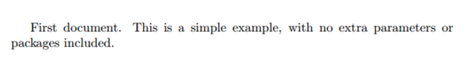

    


Это руководство нацелено на первое знакомство с LaTeX и предварительных знаний о нем от вас не потребует. К его завершению вы уже напишете свой первый документ и получите представление о ряде базовых возможностей этого инструмента.

# Что такое LaTeX?

LaTEX (произносится как «лэйтех» или «латех») представляет собой инструмент для создания профессиональных документов. В его основе лежит парадигма редактирования WYSIWYM (что вижу, то и подразумеваю), то есть от пользователя требуется сосредоточиться только на содержимом документа, оставив его форматирование программе. Вместо ручного распределения текста по странице, как это делается в Microsoft Word или LibreOffice Writer, можно просто его вводить, позволив LaTeX заняться остальным.

# Зачем нужен LaTeX?

Этот инструмент используется повсеместно для создания научных документов, написания книг, а также многих других форм публикаций. Он позволяет не только создавать красиво оформленные документы, но также дает пользователям возможность очень быстро реализовывать такие сложные элементы печатного набора, как математические выражения, таблицы, ссылки и библиографии, получая согласованную разметку по всем разделам.

Благодаря доступности большого числа открытых библиотек (об этом чуть позже) возможности LaTEX становятся практически безграничны. Эти библиотеки расширяют возможности пользователей еще больше, позволяя добавлять сноски, рисовать схемы и пр.

Одна из наиболее веских причин, по которой многие используют LaTeX, заключается в отделении содержания документа от его стиля. Это означает, что после написания содержимого, можно с легкостью изменять его внешний вид. Аналогичным образом, можно создать один стиль документа и использовать его для стандартизации внешнего вида других.

Это позволяет научным журналам создавать шаблоны для предлагаемых на рассмотрение материалов. Такие шаблоны имеют заданную разметку, в результате чего добавить остается лишь содержание. На деле существуют сотни подобных шаблонов, начиная с различных резюме и заканчивая презентациями слайдов.

# Пишем первый документ

Изначально нам потребуется новый проект, начать который можно либо создав файл `.tex`, либо через Overleaf. Возьмем простейший пример:

```
\documentclass{article}

\begin{document}
First document. This is a simple example, with no 
extra parameters or packages included.
\end{document}
```



Здесь мы видим, что LaTeX уже позаботился о первом элементе форматирования, сделав отступ в начальной строке абзаца. Теперь более подробно рассмотрим, за что отвечает каждая часть кода.

## Открыть пример в Overleaf

Первая строка объявляет тип документа, называемый классом. Класс определяет общее представление документа. Для разных типов документов требуются разные классы, то есть для CV/резюме будет использоваться свой класс, а для научного труда свой. В данном случае классом является `article`, самый простой и распространенный в LaTeX. Другие типы документов, с которыми вам, возможно, придется работать, могут потребовать использования других классов, например `book` или `report`.

После этого мы пишем содержание документа, заключенное в теги `\begin{document}` и `\end{document}`, представляющие его тело. Можете начать писать здесь текст и при желании вносить в него изменения.

Чтобы увидеть результат этих изменений в PDF, документ нужно скомпилировать. В Overleaf для этого нужно просто нажать Recompile. (Также можете настроить проект на автоматическую перекомпиляцию в процессе редактирования файлов, нажав на небольшую стрелку рядом с кнопкой Recompile и установив Auto Compile как On).

Если вы используете базовый текстовый редактор, например gedit, emacs, vim, sublime, блокнот и пр., то нужно будет компилировать документ вручную. Для этого просто выполните в терминале `pdflatex <your document>`. Подробнее об этом процессе можете почитать здесь.

При использовании специального редактора LaTeX вроде TeXmaker или TeXworks нужно просто нажать кнопку Recompile. Если не знаете, где она находится, обратитесь к документации.

Теперь, когда вы разобрались, как добавлять в документ содержимое, следующим шагом будет его именование. 
