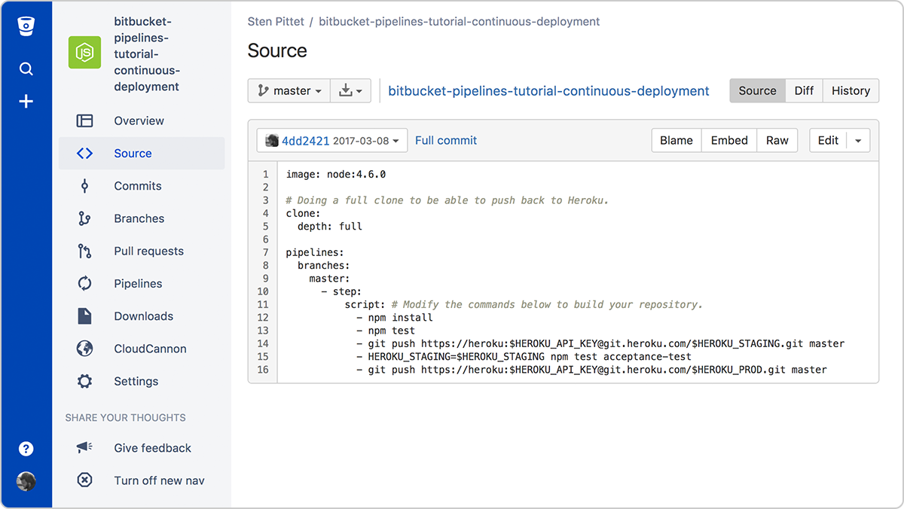

    
В контексте современных методов разработки и DevOps часто используются аббревиатуры CI и CD. Аббревиатура CI означает непрерывную интеграцию. Это фундаментальная рекомендация DevOps, согласно которой разработчики должны регулярно проводить слияние изменений кода в центральном репозитории, где выполняются автоматизированные сборки и тесты. Аббревиатура CD может означать как непрерывную поставку, так и непрерывное развертывание.

# В чем разница между непрерывной интеграцией, непрерывной поставкой и непрерывным развертыванием (CI/CD)?

## Непрерывная интеграция

Разработчики, применяющие непрерывную интеграцию, при каждой возможности выполняют слияние своих изменений с основной веткой. Изменения, внесенные разработчиком, проверяются путем создания сборки и запуска автоматических тестов на этой сборке. С таким подходом вы избегаете сложностей при интеграции, когда нужно ждать дня релиза, чтобы выполнить слияние изменений в соответствующей ветке.

При использовании непрерывной интеграции уделяется большое внимание автоматизации тестирования, в результате которого при интеграции новых коммитов в основную ветку работа приложения не нарушается.

## Непрерывная поставка

Непрерывная поставка является продолжением непрерывной интеграции, поскольку при ней происходит автоматическое развертывание всех изменений кода в тестовой и (или) рабочей среде после этапа сборки.

Это значит, что автоматизирован не только процесс тестирования, но и процесс выпуска продукта, поэтому приложение можно развернуть в любое время одним нажатием.

Теоретически при непрерывной поставке вы можете выпускать релизы ежедневно, еженедельно, каждые две недели или с любой другой периодичностью, актуальной для бизнеса. Однако если вы действительно хотите получить преимущества от непрерывной поставки, следует выполнять развертывание в рабочей среде как можно раньше, обеспечивая выпуск небольших пакетов изменений, в которых легко найти ошибку в случае проблем.

## Непрерывное развертывание

Непрерывное развертывание идет на один шаг дальше, чем непрерывная поставка. При этом подходе каждое изменение, которое проходит все стадии производственного конвейера, выпускается для клиентов. Вмешательство человека не требуется, и развертыванию нового изменения в рабочую среду может помешать только ошибка во время теста.

Непрерывное развертывание — это отличный способ ускорить цикл обратной связи с клиентами и избавить команду от лишнего напряжения, отменив «день релиза». Разработчики могут сосредоточиться на создании ПО. Они видят, как их код запускается в работу за считанные минуты, стоит только закончить.

# Как эти подходы взаимосвязаны друг с другом

Проще говоря, непрерывная интеграция является частью как непрерывной поставки, так и непрерывного развертывания. А непрерывное развертывание похоже на непрерывную поставку, за исключением того, что релизы выполняются автоматически.

# Каковы преимущества каждого из подходов?

Мы объяснили разницу между непрерывной интеграцией, непрерывной поставкой и непрерывным развертыванием, но еще не рассмотрели причины, по которым стоит внедрять эти подходы. Очевидно, что внедрение каждого из них требует расходов, но это в значительной степени оправдывается получаемыми преимуществами.

## Непрерывная интеграция

### Что от вас потребуется (расходы)

- Вашей команде придется писать автоматические тесты для каждой новой функции, улучшения или баг-фикса.
- Необходим сервер непрерывной интеграции, который может отслеживать основной репозиторий и автоматически запускать тесты для каждого нового отправленного коммита.
- Разработчикам необходимо выполнять слияние своих изменений как можно чаще, как минимум один раз в день.

### Что вы получите

- В рабочую среду попадает меньше багов, поскольку за счет автоматических тестов ухудшения обнаруживаются на ранних этапах.
- Когда все проблемы интеграции решаются на ранних этапах, сборка релиза проходит легко.
- Переключаться на другой контекст приходится реже, так как разработчики получают предупреждение сразу же, как только нарушат сборку, и могут поработать над исправлением, прежде чем перейти к другой задаче.
- Радикально снижаются затраты на тестирование: ваш CI‑сервер может выполнять сотни тестов за несколько секунд.
- Команда контроля качества тратит меньше времени на тестирование и может сосредоточиться на повышении культуры качества.

## Непрерывная поставка

### Что от вас потребуется (расходы)

- Для непрерывной интеграции нужна прочная основа. Ваш комплект тестов должен покрывать достаточную часть базы кода.
- Развертывания необходимо автоматизировать. Хотя запуск все еще осуществляется вручную, после начала развертывания вмешательство человека требоваться не должно.
- Скорее всего, вашей команде понадобится освоить флаги возможностей, чтобы возможности, работа над которыми не завершена, не влияли на работу клиентов.

### Что вы получите

- Отныне развертывание ПО перестало быть сложным. Вашей команде больше не нужно тратить несколько дней на подготовку к релизу.
- Можно чаще выпускать релизы, ускоряя цикл обратной связи со своими клиентами.
- Решения по поводу небольших изменений принимаются без лишнего напряжения, что способствует ускорению итераций.

## Непрерывное развертывание

### Что от вас потребуется (расходы)

- Ваша культура тестирования должна быть на самом высоком уровне. Качество вашего комплекта тестов будет определять качество ваших релизов.
- Процесс документирования должен идти в ногу с темпами развертываний.
- Флаги возможностей становятся неотъемлемой частью процесса выпуска серьезных изменений. Они обеспечивают возможность координировать работу с другими отделами (такими как поддержка, маркетинг, PR и т. д).

### Что вы получите

- Вы сможете ускорить процесс разработки, так как вам не нужно будет прерывать его на время релизов. Конвейеры развертывания срабатывают автоматически при каждом внесении изменений.
- Сокращается количество рисков, связанных с релизами, и облегчается выпуск фиксов в случае появления проблем, поскольку каждое развертывание осуществляется после внесения сравнительно небольшого количества изменений.
- Клиенты видят непрерывный поток улучшений, при этом качество повышается каждый день, а не раз в месяц, квартал или год.

Традиционно одной из статей расходов, связанных с непрерывной интеграцией, является установка и обслуживание сервера CI. Однако можно значительно сократить расходы на внедрение этих подходов, используя облачный сервис, например Bitbucket Pipelines, который добавляет возможности автоматизации в каждый репозиторий Bitbucket. Просто добавив файл конфигурации в корень репозитория, можно создать конвейер непрерывного развертывания, который будет выполняться для каждого нового изменения, отправляемого в основную ветку.

# Переход от непрерывной интеграции к непрерывному развертыванию

Если вы только начинаете работу над новым проектом и у вас пока нет пользователей, вам может быть просто развертывать каждый коммит в рабочую среду. Можно даже начать с автоматизации развертываний и выпустить альфа-версию в рабочую среду без клиентов. Затем, по мере разработки приложения, вы будете повышать культуру тестирования и увеличивать покрытие кода. А к тому времени, когда вы будете готовы подключать пользователей, у вас выработается отличный процесс непрерывного развертывания, где все новые изменения тестируются перед их автоматическим выпуском в рабочую среду.

Но если у вас уже есть приложение, которым пользуются клиенты, стоит притормозить и начать с непрерывной интеграции и непрерывной поставки. Начните с внедрения базовых модульных тестов, которые запускаются автоматически. На данном этапе еще рано фокусироваться на сложном сквозном тестировании. Вместо этого нужно постараться как можно скорее автоматизировать развертывания и перейти к этапу, на котором развертывания в промежуточные среды будут выполняться автоматически. Когда вы наладите автоматические развертывания, можно будет сосредоточиться на совершенствовании тестов, вместо того чтобы периодически делать остановки для координации процесса выпуска.

Как только выпуск ПО начнет происходить ежедневно, можно будет рассматривать возможность непрерывного развертывания. Однако перед этим необходимо убедиться, что к такому повороту готова и остальная часть вашей организации: документация, поддержка, маркетинг. Эти подразделения тоже должны адаптироваться к новой частоте выпуска релизов. Важно организовать процесс так, чтобы они не пропускали значительных изменений, которые могут повлиять на клиентов.
